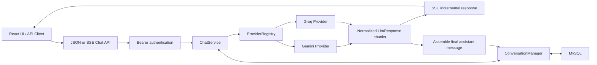

# AI Platform

A full-stack AI chat gateway with a Spring Boot backend and React frontend. It routes normalized
chat requests to multiple LLM providers while keeping credentials, authentication, conversation
history, and usage records on the server.

The current milestone is an account-scoped conversational product built on an explicit
**LLM gateway**. Clients select a provider and concrete model; the gateway adapts provider
protocols and exposes both regular JSON and streaming SSE responses.

## What Works Today

- End-to-end Gemini API integration
- End-to-end Groq API integration
- Provider-neutral interface with Gemini and Groq adapters
- Immutable runtime provider registry
- Configuration-driven provider connections and supported-model allowlist
- Read-only model discovery API backed by the gateway configuration
- Request-level explicit provider and concrete model selection
- Normalized chat request and response objects
- API keys loaded from environment variables
- Consistent JSON error responses for invalid requests and provider failures
- Explicit request IDs propagated through the chat chain and correlated through MDC
- Human-readable local logs and ECS JSON logs for production
- React web UI with separate Playground, Analytics, and Request Logs routes
- MySQL request ledger with filtered, paginated request-log queries
- Username/password registration and login with BCrypt password hashing
- Revocable Bearer sessions backed by hashed tokens in MySQL
- Authentication protection for all gateway and usage APIs
- Persistent user/assistant conversation history with cursor pagination
- SSE chat streaming with incremental Markdown rendering in the web UI
- Provider-native conversation history (`messages[]` for Groq and `contents[]` for Gemini)
- User-owned projects that group related conversations
- ChatGPT-style sidebar navigation with project creation and conversation moves

## Request Flow



`ChatService` validates the provider/model pair, resolves the user's conversation, appends the new
user message, and loads the ordered history. Provider-specific payloads stay inside each adapter:
Groq receives OpenAI-compatible `messages[]`, while Gemini receives one `contents[]` entry per
message and maps the internal `assistant` role to Gemini's `model` role. During streaming, chunks
are forwarded immediately and assembled in memory; only one complete assistant message is written
to MySQL when the stream finishes successfully.

## API

### Chat Completions

All chat endpoints require a Bearer session token and use the same JSON request body.

#### Regular response

```http
POST /api/v1/chat/completions
Content-Type: application/json
Authorization: Bearer <session-token>
```

```json
{
  "conversationId": null,
  "projectId": null,
  "provider": "gemini",
  "model": "gemini-flash-latest",
  "userMessage": "Explain how AI works in a few words"
}
```

The regular endpoint returns one normalized response:

```json
{
  "conversationId": "7f87c29f-d51b-4ed4-a0a2-d9e2cc1a75dd",
  "content": "Data + Algorithms = Insights",
  "promptTokens": 0,
  "completionTokens": 0,
  "totalTokens": 0,
  "providerName": "gemini"
}
```

#### Streaming response

```http
POST /api/v1/chat/completions/stream
Content-Type: application/json
Accept: text/event-stream
Authorization: Bearer <session-token>
```

The stream emits named SSE events. The first `message` event establishes the new
`conversationId`; later events contain provider text deltas and, when available, token usage.
The following stream is abbreviated and omits nullable token fields:

```text
event:message
data:{"conversationId":"7f87c29f-d51b-4ed4-a0a2-d9e2cc1a75dd","content":"","providerName":"gemini"}

event:message
data:{"conversationId":"7f87c29f-d51b-4ed4-a0a2-d9e2cc1a75dd","content":"Data + ","providerName":"gemini"}

event:message
data:{"conversationId":"7f87c29f-d51b-4ed4-a0a2-d9e2cc1a75dd","content":"Algorithms = Insights","providerName":"gemini"}
```

If the provider fails after streaming has started, the endpoint emits an `error` event. The web UI
consumes the response with `fetch` and a `ReadableStream`, appending each delta to the current
assistant message and re-rendering its Markdown as data arrives.

Omit `conversationId` to create a conversation. Send the returned ID with the next request to
append the new user and assistant messages to the same conversation and include its history in
the next provider request. `projectId` is optional when creating a conversation; it does not move
an existing conversation. Token values depend on whether the selected provider returns usage
metadata.

### Conversations and Projects

```http
GET   /api/v1/conversations?limit=20&unassignedOnly=true
GET   /api/v1/conversations?limit=20&projectId=<project-id>
GET   /api/v1/conversations/<conversation-id>
PATCH /api/v1/conversations/<conversation-id>/project

GET  /api/v1/projects
GET  /api/v1/projects/<project-id>
POST /api/v1/projects
```

Conversation lists use an opaque cursor returned as `nextCursor`. Sending `projectId` when the
first message creates a conversation directly in that project. The move endpoint accepts a
project ID or `null` to return the conversation to the unassigned Chats list. Every project and
conversation lookup is scoped to the authenticated user.

Create a project with:

```json
{
  "name": "Agent Runtime"
}
```

Move a conversation by sending this body to the `PATCH` endpoint:

```json
{
  "projectId": "15bbfa3e-06cd-4ad2-a222-788dc29f34db"
}
```

Use `{"projectId": null}` to move it back to the unassigned Chats list.

### Web UI Behavior

- Conversation lists load progressively with cursor pagination and an intersection observer.
- A new conversation can be created inside a project or moved between a project and Chats.
- Assistant text is rendered with `react-markdown` and GitHub Flavored Markdown support.
- Streaming deltas update the active Markdown message without persisting each individual chunk.

### Model Discovery

```http
GET /api/v1/models
```

```json
[
  {
    "provider": "gemini",
    "model": "gemini-flash-latest"
  },
  {
    "provider": "groq",
    "model": "llama-3.3-70b-versatile"
  }
]
```

The response above is abbreviated. The endpoint exposes every model from enabled provider configurations, and the demo UI loads it at startup instead of maintaining a separate hardcoded model list.

### Usage Analytics

```http
GET /api/v1/usage/statistics
GET /api/v1/usage/requests?page=1&pageSize=20&provider=gemini&status=FAILED
```

The request log endpoint supports these optional filters:

- `requestId`: exact request ID
- `provider` and `model`: exact provider/model pair
- `status`: `SUCCESS` or `FAILED`
- `requestedFrom` and `requestedTo`: ISO-8601 local date-time boundaries
- `page`: one-based page number
- `pageSize`: number of rows from 1 to 100

The response contains `items`, `page`, `pageSize`, `totalItems`, and `totalPages`. Filtering and pagination run in MySQL rather than loading the complete request ledger into application memory.
Usage data is scoped by the authenticated user: `USER` accounts only see their own request records and
statistics, while `ADMIN` accounts see the complete ledger, including historical records without an owner.

### Authentication

Create a local account, sign in, inspect the current user, and revoke the session with:

```http
POST /api/v1/auth/register
POST /api/v1/auth/login
GET  /api/v1/auth/me
POST /api/v1/auth/logout
```

Registration accepts `username`, `password`, and an optional `displayName`. Login returns an opaque
Bearer token. Only the token's SHA-256 digest is stored in MySQL, and passwords are stored as BCrypt
hashes. Send the raw token on protected requests:

```http
Authorization: Bearer <session-token>
```

All `/api/**` endpoints require authentication except registration and login. Public registration is
enabled by default for local development and disabled by default in the production profile. Set
`AUTH_REGISTRATION_ENABLED=true` only when a production environment should allow account creation.
Session lifetime defaults to 12 hours and can be changed with `AUTH_SESSION_TTL`, for example `24h`.
New registrations always receive the `USER` role. Promote a trusted account from the MySQL console:

```sql
UPDATE app_user SET role = 'ADMIN' WHERE username = 'admin';
```

## Supported Models

Clients provide the provider and model as separate fields. The current allowlist is:

- Gemini: `gemini-3.6-flash`, `gemini-3.5-flash`, `gemini-3.5-flash-lite`, `gemini-3.1-pro-preview`, `gemini-3.1-flash-lite`, `gemini-2.5-pro`, `gemini-2.5-flash`, `gemini-2.5-flash-lite`, `gemini-flash-latest`
- Groq: `llama-3.3-70b-versatile`, `llama-3.1-8b-instant`, `openai/gpt-oss-120b`, `openai/gpt-oss-20b`, `groq/compound`, `groq/compound-mini`, `qwen/qwen3.6-27b`

Only text-generating models compatible with the gateway's current chat endpoints are included. Audio, image, embedding, and moderation-specific models require different request and response adapters.

Each provider's connection and model allowlist live together in `src/main/resources/application.yml`. Adding a model that uses an existing provider protocol requires configuration and an application restart; the model discovery API and demo UI then expose it automatically. Adding a provider with a new protocol requires a new `LlmProvider` adapter.

## Run Locally

Prerequisites:

- Java 21+
- Maven 3.9+
- Node.js 20.19+
- pnpm 11+
- MySQL 8.4+
- A Gemini API key and/or Groq API key

Create the local database tables in migration order:

```bash
mysql -u root -p < database/mysql/001_create_llm_request_record.sql
mysql -u root -p < database/mysql/002_create_auth_tables.sql
mysql -u root -p < database/mysql/003_add_user_role_and_request_owner.sql
mysql -u root -p < database/mysql/004_create_chat_tables.sql
```

Create a dedicated application user from the MySQL console:

```sql
CREATE USER 'ai_platform_app'@'localhost'
    IDENTIFIED BY 'choose-a-local-password';

GRANT SELECT, INSERT, UPDATE, DELETE
    ON ai_platform.*
    TO 'ai_platform_app'@'localhost';

FLUSH PRIVILEGES;
```

Set database and provider credentials in your shell or IDE run configuration:

```bash
export AI_PLATFORM_DB_URL="jdbc:mysql://localhost:3306/ai_platform?useSSL=false&allowPublicKeyRetrieval=true&serverTimezone=UTC"
export AI_PLATFORM_DB_USERNAME="ai_platform_app"
export AI_PLATFORM_DB_PASSWORD="your-local-database-password"
export GEMINI_API_KEY="your-gemini-api-key"
export GROQ_API_KEY="your-groq-api-key"
export AUTH_SESSION_TTL="12h"
export CHAT_STREAM_TIMEOUT="5m"
```

`CHAT_STREAM_TIMEOUT` controls the Spring MVC async-request timeout for long generations and
defaults to five minutes.

Install the frontend dependencies once:

```bash
cd frontend
pnpm install
cd ..
```

For frontend development, start Spring Boot from IntelliJ IDEA and run Vite in a second terminal:

```bash
cd frontend
pnpm dev
```

Open `http://localhost:5173`. Vite proxies `/api` calls to Spring Boot on port `8080`.

To serve the frontend from Spring Boot instead, build the React application into the backend static resources and then start the application:

```bash
cd frontend
pnpm build:spring
cd ..
mvn spring-boot:run
```

Open the bundled UI:

```text
http://localhost:8080/
```

Or call the streaming API directly. `--no-buffer` lets curl print each SSE event as it arrives:

```bash
curl --no-buffer --request POST "http://localhost:8080/api/v1/chat/completions/stream" \
  --header "Content-Type: application/json" \
  --header "Accept: text/event-stream" \
  --header "Authorization: Bearer ${AI_PLATFORM_TOKEN}" \
  --data '{
    "provider": "gemini",
    "model": "gemini-flash-latest",
    "userMessage": "Explain how AI works in a few words"
  }'
```

Never commit API keys. The YAML configuration stores environment variable names only.

Local logs keep Spring Boot's default console format and add the current request ID. To emit
ECS-compatible JSON logs for Elasticsearch ingestion, activate the production profile:

```bash
export SPRING_PROFILES_ACTIVE=prod
export APP_ENV=prod
export APP_VERSION=0.0.1
```

The application writes logs to standard output; a deployment-side agent should collect and ship
them rather than having the application write directly to Elasticsearch.

## Tech Stack

- Java 21
- Spring Boot 4
- Spring MVC with `RestClient` for regular calls and `WebClient`/Reactor `Flux` for streaming calls
- Jackson
- MySQL 8.4
- MyBatis 4 with XML mappers
- H2 for persistence integration tests
- Maven
- React 19
- TypeScript
- Vite
- React Router

Frontend source lives in `frontend/`. The `src/main/resources/static/` directory contains generated production assets and should not be edited by hand. See `frontend/README.md` for the development and single-JAR build workflows.

## Roadmap

1. **Conversation lifecycle**
   Add rename, delete, search, archive, edit, regenerate, and context-window summarization.
2. **Streaming controls**
   Add stop generation, cancellation accounting, reconnect handling, and partial-response policy.
3. **Gateway resilience**
   Add runtime failover, bounded retries, timeouts, rate limiting, and circuit breaking.
4. **Observability**
   Add latency metrics, provider-level success rates, and distributed tracing.
5. **Agent runtime**
   Implement function calling, a tool registry, bounded ReAct loops, step persistence, cancellation, and execution limits.
6. **Controlled code tools**
   Add workspace allowlists, path validation, file-size limits, timeouts, and explicit tool permissions before enabling code or file access.

## Status

This is an actively developed portfolio project. The README describes the behavior currently present in the repository; roadmap items are intentionally listed separately.
