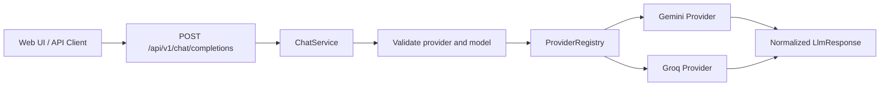

# AI Platform

A Spring Boot backend that exposes one chat API and routes requests to different LLM providers through a normalized request/response model.

The current milestone is a small, explicit **LLM gateway**. Clients provide a provider and one of its concrete models, while the gateway normalizes provider protocols and keeps upstream credentials on the server.

## What Works Today

- End-to-end Gemini API integration
- End-to-end Groq API integration
- Provider-neutral interface with Gemini and Groq adapters
- Immutable runtime provider registry
- Configuration-driven provider connections and supported-model allowlist
- Read-only model discovery API backed by the gateway configuration
- Request-level explicit provider and concrete model selection
- Normalized chat request and response objects
- API keys loaded from environment variables
- Consistent JSON error responses for invalid requests and provider failures
- React web UI with separate Playground, Analytics, and Request Logs routes
- MySQL request ledger with filtered, paginated request-log queries

## Request Flow



`ChatService` validates the requested provider and checks the model against that provider's allowlist. It then builds a provider-neutral `LlmRequest` and delegates it to the registered provider implementation. Provider-specific payloads and response parsing stay inside each adapter.

## API

### Request

```http
POST /api/v1/chat/completions
Content-Type: application/json
```

```json
{
  "provider": "gemini",
  "model": "gemini-flash-latest",
  "userMessage": "Explain how AI works in a few words"
}
```

### Response

```json
{
  "content": "Data + Algorithms = Insights",
  "promptTokens": 0,
  "completionTokens": 0,
  "providerName": "gemini"
}
```

Token values depend on whether the selected provider returns usage metadata.

### Model Discovery

```http
GET /api/v1/models
```

```json
[
  {
    "provider": "gemini",
    "model": "gemini-flash-latest"
  },
  {
    "provider": "groq",
    "model": "llama-3.3-70b-versatile"
  }
]
```

The response above is abbreviated. The endpoint exposes every model from enabled provider configurations, and the demo UI loads it at startup instead of maintaining a separate hardcoded model list.

### Usage Analytics

```http
GET /api/v1/usage/statistics
GET /api/v1/usage/requests?page=1&pageSize=20&provider=gemini&status=FAILED
```

The request log endpoint supports these optional filters:

- `requestId`: exact request ID
- `provider` and `model`: exact provider/model pair
- `status`: `SUCCESS` or `FAILED`
- `requestedFrom` and `requestedTo`: ISO-8601 local date-time boundaries
- `page`: one-based page number
- `pageSize`: number of rows from 1 to 100

The response contains `items`, `page`, `pageSize`, `totalItems`, and `totalPages`. Filtering and pagination run in MySQL rather than loading the complete request ledger into application memory.

## Supported Models

Clients provide the provider and model as separate fields. The current allowlist is:

- Gemini: `gemini-3.6-flash`, `gemini-3.5-flash`, `gemini-3.5-flash-lite`, `gemini-3.1-pro-preview`, `gemini-3.1-flash-lite`, `gemini-2.5-pro`, `gemini-2.5-flash`, `gemini-2.5-flash-lite`, `gemini-flash-latest`
- Groq: `llama-3.3-70b-versatile`, `llama-3.1-8b-instant`, `openai/gpt-oss-120b`, `openai/gpt-oss-20b`, `groq/compound`, `groq/compound-mini`, `qwen/qwen3.6-27b`

Only text-generating models compatible with the gateway's current chat endpoints are included. Audio, image, embedding, and moderation-specific models require different request and response adapters.

Each provider's connection and model allowlist live together in `src/main/resources/application.yml`. Adding a model that uses an existing provider protocol requires configuration and an application restart; the model discovery API and demo UI then expose it automatically. Adding a provider with a new protocol requires a new `LlmProvider` adapter.

## Run Locally

Prerequisites:

- Java 21+
- Maven 3.9+
- Node.js 20.19+
- pnpm 11+
- MySQL 8.4+
- A Gemini API key and/or Groq API key

Create the local request-ledger table:

```bash
mysql -u root -p < database/mysql/001_create_llm_request_record.sql
```

Create a dedicated application user from the MySQL console:

```sql
CREATE USER 'ai_platform_app'@'localhost'
    IDENTIFIED BY 'choose-a-local-password';

GRANT SELECT, INSERT, UPDATE, DELETE
    ON ai_platform.*
    TO 'ai_platform_app'@'localhost';

FLUSH PRIVILEGES;
```

Set database and provider credentials in your shell or IDE run configuration:

```bash
export AI_PLATFORM_DB_URL="jdbc:mysql://localhost:3306/ai_platform?useSSL=false&allowPublicKeyRetrieval=true&serverTimezone=UTC"
export AI_PLATFORM_DB_USERNAME="ai_platform_app"
export AI_PLATFORM_DB_PASSWORD="your-local-database-password"
export GEMINI_API_KEY="your-gemini-api-key"
export GROQ_API_KEY="your-groq-api-key"
```

Install the frontend dependencies once:

```bash
cd frontend
pnpm install
cd ..
```

For frontend development, start Spring Boot from IntelliJ IDEA and run Vite in a second terminal:

```bash
cd frontend
pnpm dev
```

Open `http://localhost:5173`. Vite proxies `/api` calls to Spring Boot on port `8080`.

To serve the frontend from Spring Boot instead, build the React application into the backend static resources and then start the application:

```bash
cd frontend
pnpm build:spring
cd ..
mvn spring-boot:run
```

Open the bundled UI:

```text
http://localhost:8080/
```

Or call the API directly:

```bash
curl --request POST "http://localhost:8080/api/v1/chat/completions" \
  --header "Content-Type: application/json" \
  --data '{
    "provider": "gemini",
    "model": "gemini-flash-latest",
    "userMessage": "Explain how AI works in a few words"
  }'
```

Never commit API keys. The YAML configuration stores environment variable names only.

## Tech Stack

- Java 21
- Spring Boot 4
- Spring MVC `RestClient`
- Jackson
- MySQL 8.4
- MyBatis 4 with XML mappers
- H2 for persistence integration tests
- Maven
- React 19
- TypeScript
- Vite
- React Router

Frontend source lives in `frontend/`. The `src/main/resources/static/` directory contains generated production assets and should not be edited by hand. See `frontend/README.md` for the development and single-JAR build workflows.

## Roadmap

1. **Gateway resilience**
   Add runtime failover, bounded retries, timeouts, rate limiting, and circuit breaking.
2. **Observability**
   Add request IDs, latency metrics, provider-level success rates, and traceable execution records.
3. **Agent runtime**
   Implement function calling, a tool registry, bounded ReAct loops, step persistence, cancellation, and execution limits.
4. **Controlled code tools**
   Add workspace allowlists, path validation, file-size limits, timeouts, and explicit tool permissions before enabling code or file access.

## Status

This is an actively developed portfolio project. The README describes the behavior currently present in the repository; roadmap items are intentionally listed separately.
