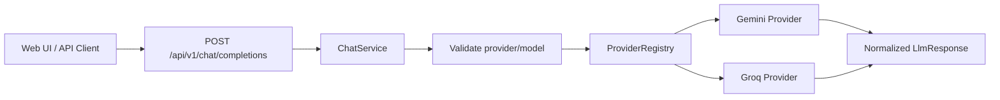

# AI Platform

A Spring Boot backend that exposes one chat API and routes requests to different LLM providers through a normalized request/response model.

The current milestone is a small, explicit **LLM gateway**. Clients select a concrete model using `provider/model`, while the gateway normalizes provider protocols and keeps upstream credentials on the server.

## What Works Today

- End-to-end Gemini API integration
- End-to-end Groq API integration
- Provider-neutral interface with Gemini and Groq adapters
- Immutable runtime provider registry
- Configuration-driven provider connections and supported-model allowlist
- Request-level concrete model selection using `provider/model`
- Normalized chat request and response objects
- API keys loaded from environment variables
- Consistent JSON error responses for invalid requests and provider failures
- Minimal web UI for sending prompts and inspecting responses and token usage
- MySQL persistence for application credentials using MyBatis XML mappers
- API key issuance, SHA-256 hashing, active-key lookup, and credential revocation

## Request Flow



`ChatService` validates the requested model, parses its provider prefix, builds a provider-neutral `LlmRequest`, and delegates it to the registered provider implementation. Provider-specific payloads and response parsing stay inside each adapter.

## API

### Request

```http
POST /api/v1/chat/completions
Content-Type: application/json
```

```json
{
  "model": "gemini/gemini-flash-latest",
  "userMessage": "Explain how AI works in a few words"
}
```

### Response

```json
{
  "content": "Data + Algorithms = Insights",
  "promptTokens": 0,
  "completionTokens": 0,
  "providerName": "gemini"
}
```

Token values depend on whether the selected provider returns usage metadata.

## Supported Models

Clients select a concrete model using the `provider/model` format. The current allowlist is:

- `gemini/gemini-flash-latest`
- `groq/llama-3.3-70b-versatile`

Provider connections and the model allowlist live in `src/main/resources/application.yml`. Adding a model that uses an existing provider protocol requires configuration only; adding a provider with a new protocol requires a new `LlmProvider` adapter.

## Run Locally

Prerequisites:

- Java 21+
- Maven 3.9+
- MySQL 8.4+
- A Gemini API key and/or Groq API key

Create the local database and credential table:

```bash
mysql -u root -p < database/mysql/001_create_app_credential.sql
```

Create a dedicated application user from the MySQL console:

```sql
CREATE USER 'ai_platform_app'@'localhost'
    IDENTIFIED BY 'choose-a-local-password';

GRANT SELECT, INSERT, UPDATE, DELETE
    ON ai_platform.*
    TO 'ai_platform_app'@'localhost';

FLUSH PRIVILEGES;
```

Set database and provider credentials in your shell or IDE run configuration:

```bash
export AI_PLATFORM_DB_URL="jdbc:mysql://localhost:3306/ai_platform?useSSL=false&allowPublicKeyRetrieval=true&serverTimezone=UTC"
export AI_PLATFORM_DB_USERNAME="ai_platform_app"
export AI_PLATFORM_DB_PASSWORD="your-local-database-password"
export GEMINI_API_KEY="your-gemini-api-key"
export GROQ_API_KEY="your-groq-api-key"
```

Run the tests and start the application:

```bash
mvn clean test
mvn spring-boot:run
```

Open the demo UI:

```text
http://localhost:8080/
```

Or call the API directly:

```bash
curl --request POST "http://localhost:8080/api/v1/chat/completions" \
  --header "Content-Type: application/json" \
  --data '{
    "model": "gemini/gemini-flash-latest",
    "userMessage": "Explain how AI works in a few words"
  }'
```

Never commit API keys. The YAML configuration stores environment variable names only.

## Tech Stack

- Java 21
- Spring Boot 4
- Spring MVC `RestClient`
- Jackson
- MySQL 8.4
- MyBatis 4 with XML mappers
- H2 for persistence integration tests
- Maven
- Vanilla HTML/CSS/JavaScript demo UI

## Roadmap

1. **Request authentication and usage accounting**
   Authenticate gateway requests with issued API keys, then persist request records, quotas, and token usage.
2. **Gateway resilience**
   Add runtime failover, bounded retries, timeouts, rate limiting, and circuit breaking.
3. **Observability**
   Add request IDs, latency metrics, provider-level success rates, and traceable execution records.
4. **Agent runtime**
   Implement function calling, a tool registry, bounded ReAct loops, step persistence, cancellation, and execution limits.
5. **Controlled code tools**
   Add workspace allowlists, path validation, file-size limits, timeouts, and explicit tool permissions before enabling code or file access.

## Status

This is an actively developed portfolio project. The README describes the behavior currently present in the repository; roadmap items are intentionally listed separately.
