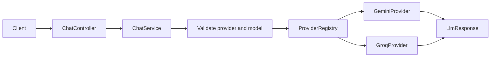

# Multi-Provider LLM Gateway 需求文档

> 文档版本：2.1
> 更新日期：2026-08-02
> 原则：代码只表达已经确认的需求；未来能力保留在 Backlog，不提前进入生产模型。

## 1. 项目定位

本项目提供一个统一的 Chat API。调用方明确指定具体模型，网关负责：

- 校验模型是否允许调用。
- 根据请求中明确的 `provider` 选择协议 Adapter。
- 将统一请求转换为 Gemini、Groq 等 Provider 的原生协议。
- 将 Provider 响应转换为统一响应。
- 在后续里程碑中增加用量治理、可靠性和可观测性。

项目当前不提供虚拟模型别名，也不替调用方选择模型。

## 2. 核心 API

### 2.1 Chat Completion

```http
POST /api/v1/chat/completions
Content-Type: application/json
```

```json
{
  "provider": "gemini",
  "model": "gemini-flash-latest",
  "userMessage": "Explain how DNS works"
}
```

`provider` 是网关 Provider Code，`model` 是该 Provider 上游的具体模型名。两者是独立字段，不使用复合字符串。

响应：

```json
{
  "content": "...",
  "promptTokens": 0,
  "completionTokens": 0,
  "providerName": "gemini"
}
```

### 2.2 模型发现

```http
GET /api/v1/models
```

接口只返回已启用 Provider 的白名单模型：

```json
[
  {
    "provider": "gemini",
    "model": "gemini-flash-latest"
  }
]
```

Web UI 在启动时调用该接口生成模型选项，不在 HTML 中维护第二份模型列表。该能力不包含 Provider 自动发现或运行时热更新。

### 2.3 错误语义

| 场景 | HTTP 状态 | 错误类型 |
|---|---:|---|
| `provider` 为空 | 400 | Invalid request |
| Provider 不存在 | 400 | Unsupported provider |
| `model` 为空 | 400 | Invalid request |
| 模型不在该 Provider 白名单 | 400 | Unsupported model |
| Provider 返回错误 | 502 | Provider error |
| 未预期异常 | 500 | Internal error |

## 3. 配置模型

### 3.1 Provider 配置

一个 Provider 当前只有一套连接配置：

```yaml
ai:
  gateway:
    providers:
      gemini:
        base-url: https://generativelanguage.googleapis.com
        api-key-env: GEMINI_API_KEY
        enabled: true
        supported-models:
          - gemini-flash-latest

      groq:
        base-url: https://api.groq.com/openai/v1
        api-key-env: GROQ_API_KEY
        enabled: true
        supported-models:
          - llama-3.3-70b-versatile
```

Provider 配置只描述：

- 如何连接 Provider。
- 从哪个环境变量读取密钥。
- Provider 是否启用。
- 该 Provider 允许调用哪些上游模型。

当前不配置默认模型、endpoint、优先级、retry 或 fallback。

### 3.2 模型白名单

```yaml
ai:
  gateway:
    providers:
      gemini:
        supported-models:
          - gemini-flash-latest

      groq:
        supported-models:
          - llama-3.3-70b-versatile
```

同一 Provider 上线协议兼容的新模型时，只需要增加配置并重启应用，不修改 Java：

```yaml
providers:
  gemini:
    supported-models:
      - gemini-flash-latest
      - new-model
```

新增协议不同的 Provider 时，必须增加新的 `LlmProvider` Adapter。

## 4. 当前架构



### 4.1 `ChatService`

负责：

- 校验 Provider Code。
- 校验模型是否在该 Provider 的白名单中。
- 创建统一 `LlmRequest`。
- 从 Registry 查找 Adapter。
- 编排一次同步调用。

不负责 Provider 原生 JSON 转换。

### 4.2 `ProviderRegistry`

维护不可变映射：

```text
GEMINI -> GeminiProvider
GROQ   -> GroqProvider
```

Registry 只负责查找，不负责模型选择、重试或负载均衡。

要求：

- Provider Code 使用强类型枚举。
- 重复注册时启动失败。
- 初始化后不支持动态修改。

### 4.3 `LlmProvider`

统一 Port：

```java
public interface LlmProvider {
    LlmProviderEnum getProviderCode();
    LlmResponse chat(LlmRequest request);
}
```

每个 Adapter 负责：

- Provider 鉴权 Header。
- Provider URL 和请求结构。
- 使用 `LlmRequest.model` 指定模型。
- Provider 响应解析。
- 返回统一 `LlmResponse`。

## 5. 当前版本范围

### 5.1 已实现

- [x] Gemini 同步 Chat Adapter。
- [x] Groq 同步 Chat Adapter。
- [x] 显式 `provider` + `model` 精确模型选择。
- [x] YAML 模型白名单。
- [x] Provider 连接配置。
- [x] 基于 YAML 配置的模型发现 API。
- [x] Web UI 动态加载模型列表。
- [x] 不可变 Provider Registry。
- [x] 统一请求和响应。
- [x] 统一异常响应。
- [x] React Web UI：Playground、Analytics 和 Request Logs。

### 5.2 明确不支持

- 虚拟模型别名。
- 网关自动选择模型。
- 跨模型 fallback。
- 动态模型热更新。
- Provider 模型自动发现。
- Streaming。
- Tool calling。
- Agent Runtime。

## 6. 近期 Backlog

### Milestone 0：守住当前行为

- [ ] 为 Gemini Adapter 增加 Mock HTTP contract tests。
- [ ] 为 Groq Adapter 增加 Mock HTTP contract tests。
- [ ] 增加空请求体和空 `userMessage` 校验。
- [ ] 增加配置启动校验：Provider base URL、Secret 名称、白名单格式。
- [ ] 确保 README 只描述测试验证过的行为。

### Milestone 1：用量治理

- [x] 持久化 request usage ledger。
- [x] 按 Provider、模型、状态和时间筛选请求记录。
- [x] MySQL 分页查询和全局用量统计。
- [ ] 区分 Provider 报告、估算和未知 token。
- [x] 默认不存储 prompt 和完整回答。

### Milestone 2：可靠性

精确模型请求默认不允许静默切换为其他模型。

- [ ] Connect timeout。
- [ ] Read timeout。
- [ ] 同一模型的有界 retry。
- [ ] Retryable 错误分类。
- [ ] Exponential backoff + jitter。
- [ ] 总请求 deadline。
- [ ] 每次 attempt 记录。

跨模型 fallback 只有在未来引入明确的虚拟模型需求后才能实现。

### Milestone 3：可观测性

- [x] Request ID。
- [x] 结构化日志。
- [ ] Micrometer/Prometheus metrics。
- [ ] OpenTelemetry request/provider spans。
- [ ] Provider 成功率和延迟。
- [ ] Token 与成本统计。

### Milestone 4：工程交付

- [ ] Docker Compose：应用、MySQL、Redis、Prometheus、Grafana。
- [ ] CI：编译、测试和镜像构建。
- [ ] Mock Provider 故障测试。
- [ ] k6 或 Gatling 压测。
- [ ] 记录真实环境和测试结果。

## 7. 可选的动态模型目录

当前模型白名单通过 YAML 加载，修改后需要重启应用。

只有出现“无重启添加模型”的真实需求时，才实现：

```text
Admin API
    -> Database-backed model catalog
    -> Validated immutable snapshot
    -> Atomic in-memory replacement
    -> GET /api/v1/models
```

第一版动态目录仍放在同一个 Spring Boot 应用中，不拆控制面和数据面服务。

当存在多地区 Gateway、独立平台团队或配置实时推送需求时，再评估 Control Plane/Data Plane 分离。

## 8. 设计约束

- 不为未来需求增加未使用字段。
- 不提交空 Provider 或 Mock Repository 作为可用实现。
- 每个新增配置字段必须有实际消费者和测试。
- 每个新增抽象必须对应当前存在的变化点。
- 新模型复用已有协议时只增加配置。
- 新协议通过新的 Provider Adapter 接入。
- 精确模型请求不做隐式跨模型替换。

## 9. Definition of Done

- [ ] `mvn test` 通过。
- [ ] Gemini/Groq 模型选择有自动测试。
- [ ] 未配置模型在 Provider 调用前被拒绝。
- [ ] 重复 Provider 注册启动失败。
- [ ] README、配置、UI 和后端请求字段一致。
- [ ] Secret 不进入源码和日志。
- [ ] 当前不支持的能力没有占位代码伪装成已实现。
